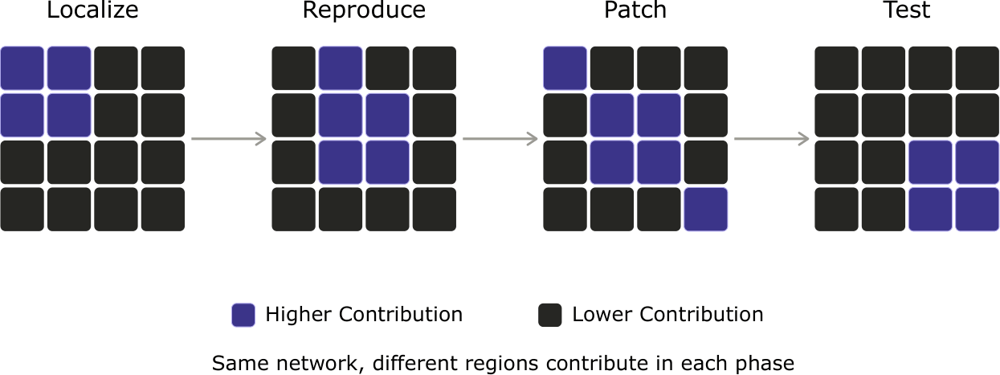

# Overview

Software bugs are costly. Beyond the developer effort spent resolving them, they can trigger failures with substantial financial consequences ([Federal Communications Commission 2024](#ref-BentonFCC2024); [Business Insider 2024](#ref-BusinessInsider2024); [Zahn et al. 2024](#ref-ZahnEtAl2024)). Resolving such bugs is therefore a challenge in software development ([Zou et al. 2020](#ref-Zouz2020)), and a time-consuming one. Indeed, developers are estimated to spend roughly half of their time on debugging and bug resolution ([Britton et al. 2013](#ref-Britton2013)). This process is cognitively demanding, as it requires a deep understanding of the codebase ([Yoon and Garcia 1998](#ref-ByungDo1998); [Hu et al. 2024](#ref-Hu2024)). 

To assist developers with this activity, automated program repair (APR) has been proposed ([Gazzola, Micucci, and Mariani 2019](#ref-Gazzola2019)). Traditionally, these systems have relied on information retrieval and template-based solutions. However, these approaches are often rigid, making it difficult to extrapolate them to unseen scenarios. Large language models
(LLMs) and LLM-based systems offer great promise in this regard. Such overly parameterized models are trained on vast datasets, and possess stronger generalization capabilities. Methods like Agentless ([Xia et al. 2025](#ref-Xia2025)) and SWE-agent ([Yang et al. 2024](#ref-Yang2024sweagent)) demonstrate a remarkable aptitude for resolving issues compared to classical APR methods.

However, their massive scale makes them expensive to operate. This cost is multifaceted: computational (requiring extensive arithmetic operations), monetary (demanding high-end computing
infrastructure), and environmental (correlating increased compute with higher emissions). It is well established that LLMs are over-parameterized, meaning, not every neuron contributes equally to a given computation, and ablating a subset can incur only minimal performance degradation ([Voita et al. 2019](#ref-Voita2019); [Sandoval-Segura et al. 2026](#ref-Sandovalsegura2026identifying); [Dong, Chen, and Chi 2024](#ref-Dong2024promptprompted)). Moreover, the set of components that matter is often *input-dependent*, a phenomenon known as contextual sparsity ([Liu et al. 2023](#ref-Liu2023dejavu)), and prior work has localized specific skills or functions to identifiable groups of neurons ([Wang et al. 2022](#ref-Wang2022skillneurons)). 

Separately, automated bug resolution follows a structured workflow. First, the process starts by localizing the bug, reproducing it, issuing a patch, and finally running tests to verify the
fix and check for regressions. In light of these two observations, we hypothesize that distinct regions of the network could be activated during the phases of the APR process. A pictorial representation of this hypothesis is illustrated in Figure 1. If this holds, the phase becomes a conditioning signal for sparsity. This is because an APR agent always knows which phase it is currently executing, we could selectively activate (or prune) only the relevant regions per phase, reducing the floating-point operations and latency of each step without sacrificing repair accuracy.

# Research Questions

We organize the investigation around three research questions that move
from existence to exploitation:

- **RQ1 (Existence).** Are neuron and attention-head activations
  separable by APR phase? That is, given the hidden activations produced
  while the model performs localization, reproduction, patching, or
  test/verification, can the phase be recovered from the activation
  pattern alone?

- **RQ2 (Structure).** If such separation exists, is it consistent and
  interpretable? How much do the active sets overlap across phases
  (e.g., measured via Jaccard similarity), are the same regions reused
  across different bugs and projects, and are the implicated components
  causally necessary for their phase?

- **RQ3 (Compute Efficiency).** Can phase-conditioned sparsity be
  exploited to reduce computational cost, floating-point operations,
  latency, or memory, without sacrificing too much performance?

# Approach

The following is a tentative methodology which can be refined as the
project progresses.

#### Defining a phase.

We take a *phase* to be an agent step (or prompt role) within an
established APR scaffold such as Agentless ([Xia et al. 2025](#ref-Xia2025)) or
SWE-agent ([Yang et al. 2024](#ref-Yang2024sweagent)): bug localization, reproduction, patch
generation, and test/verification. The main goal is to investigate if
there exist *consistent, reusable* sub-circuits within a single model
serving all phases. A minimal ReACT-based agent can also be implemented,
if needed.

#### Models.

Neuron-level inspection requires access to model weights, so we focus on
open-weights code LLMs (e.g., Qwen2.5-Coder or DeepSeek-Coder).

#### Data and harness.

SWE-bench (Verified or Lite), Defects4J.

#### Units and attribution.

The units of analysis are MLP neurons and attention heads, taken per
layer. To attribute components to phases, we plan to combine (i)
mean/peak activation statistics per phase, (ii) lightweight probing
classifiers that predict the phase from activations, (iii)
activation-overlap metrics across phases, and (iv) causal ablation to
test whether the implicated components are necessary for a given phase.
Such methods have been partially covered in the work of ([Sandoval-Segura et al. 2026](#ref-Sandovalsegura2026identifying)).

# Feasibility and Resources

Because the study targets open-weights models and reuses existing
scaffolds and benchmarks, it should be tractable. Access to GPUs is also
available.

# Logistics and Collaboration

- **Time commitment:** $6$ months. Number of hours is up to the
  candidate.

- **Mode:** Remote.

- **Target venue:** To be determined.

- **Authorship:** Ideally, we want the candidate to be the first author.
  However, that will depend later on their contribution.

# Minimum Requirements

An ideal candidate should meet the following minimum requirements:

- Interest in conducting research. This includes all aspects of the
  process from reading literature, to implementation, running
  experiments, to writing. Of course, the candidate will not be in
  charge of carrying out all of these activities end-to-end. Rather,
  they will play a role in every step.

- Be relatively comfortable with reading CS-related scientific
  literature.

- A decent understanding of deep learning.

- Basic conceptual understanding of the Transformer architecture. Not
  necessarily those with newer architectural tweaks. A basic
  understanding of the original architecture proposed by Vaswani et
  al. is enough.

- Good Python skills.

# Nice to Have

The following are qualifications that are nice-to-have, but can
definitely be acquired throughout the project:

- Knowledge of recent literature on computationally efficient language
  models. This includes (un)-structured pruning, sparse neural networks
  and input compression. This also includes familiarity with concepts
  related to such subfield such as measurement metrics like number of
  floating-point operations, throughput, wall-clock time, and so on.

- Implemented a decoder-only Transformer model in Pytorch, or played
  around with an implementation (e.g., using huggingface's transformers
  library).

# References

- Britton, Tom, Lisa Jeng, Graham Carver, Paul Cheak, and Tomer Katzenellenbogen. 2013. "Reversible Debugging Software: Quantify the Time and Cost Saved Using Reversible Debuggers." Judge Business School, University of Cambridge.

- Business Insider. 2024. "Businesses Claiming Losses from CrowdStrike Outage Could Cost Insurance Billions in Losses Under Cyber Policies." *Business Insider*. <https://www.businessinsider.com/businesses-claiming-losses-crowdstrike-outage-insurance-billions-losses-cyber-policies-2024-7>.

- Dong, Harry, Beidi Chen, and Yuejie Chi. 2024. "Prompt-Prompted Adaptive Structured Pruning for Efficient LLM Generation." In *First Conference on Language Modeling*. <https://openreview.net/forum?id=4aqq9xTtih>.

- Federal Communications Commission. 2024. "February 22, 2024 AT&T Mobility Network Outage Report and Findings." Benton Institute for Broadband & Society. <https://www.benton.org/headlines/february-22-2024-att-mobility-network-outage-report-and-findings>.

- Gazzola, Luca, Daniela Micucci, and Leonardo Mariani. 2019. "Automatic Software Repair: A Survey." *IEEE Transactions on Software Engineering* 45 (1): 34–67. <https://doi.org/10.1109/TSE.2017.2755013>.

- Hu, Danniell, Priscila Santiesteban, Madeline Endres, and Westley Weimer. 2024. "Towards a Cognitive Model of Dynamic Debugging: Does Identifier Construction Matter?" *IEEE Transactions on Software Engineering* 50 (11): 3007–21. <https://doi.org/10.1109/TSE.2024.3465222>.

- Liu, Zichang, Jue Wang, Tri Dao, Tianyi Zhou, Binhang Yuan, Zhao Song, Anshumali Shrivastava, et al. 2023. "Deja Vu: Contextual Sparsity for Efficient LLMs at Inference Time." In *Proceedings of the 40th International Conference on Machine Learning (ICML)*, 202:22137–76. Proceedings of Machine Learning Research. PMLR. <https://proceedings.mlr.press/v202/liu23am.html>.

- Sandoval-Segura, Pedro, Xijun Wang, Ashwinee Panda, Micah Goldblum, Ronen Basri, Tom Goldstein, and David Jacobs. 2026. "Identifying and Evaluating Inactive Heads in Pretrained LLMs." In *The Fourteenth International Conference on Learning Representations*. <https://openreview.net/forum?id=dfYMjaiMG4>.

- Voita, Elena, David Talbot, Fedor Moiseev, Rico Sennrich, and Ivan Titov. 2019. "Analyzing Multi-Head Self-Attention: Specialized Heads Do the Heavy Lifting, the Rest Can Be Pruned." In *Proceedings of the 57th Annual Meeting of the Association for Computational Linguistics*, edited by Anna Korhonen, David Traum, and Lluís Màrquez, 5797–5808. Florence, Italy: Association for Computational Linguistics. <https://doi.org/10.18653/v1/P19-1580>.

- Wang, Xiaozhi, Kaiyue Wen, Zhengyan Zhang, Lei Hou, Zhiyuan Liu, and Juanzi Li. 2022. "Finding Skill Neurons in Pre-Trained Transformer-Based Language Models." In *Proceedings of the 2022 Conference on Empirical Methods in Natural Language Processing (EMNLP)*, 11132–52. Association for Computational Linguistics. <https://aclanthology.org/2022.emnlp-main.765/>.

- Xia, Chunqiu Steven, Yinlin Deng, Soren Dunn, and Lingming Zhang. 2025. "Demystifying LLM-Based Software Engineering Agents." *Proc. ACM Softw. Eng.* 2 (FSE). <https://doi.org/10.1145/3715754>.

- Yang, John, Carlos E Jimenez, Alexander Wettig, Kilian Lieret, Shunyu Yao, Karthik R Narasimhan, and Ofir Press. 2024. "SWE-Agent: Agent-Computer Interfaces Enable Automated Software Engineering." In *The Thirty-Eighth Annual Conference on Neural Information Processing Systems*. <https://openreview.net/forum?id=mXpq6ut8J3>.

- Yoon, Byung-Do, and O. N. Garcia. 1998. "Cognitive Activities and Support in Debugging." In *Proceedings Fourth Annual Symposium on Human Interaction with Complex Systems*, 160–69. <https://doi.org/10.1109/HUICS.1998.659974>.

- Zahn, Max, Jon Haworth, Josh Margolin, Jack Date, and Luke Barr. 2024. "AT&T Outage Caused by Software Update, Company Says." *ABC News*. <https://abcnews.com/US/att-outage-impacting-us-customers-company/story?id=107440297>.

- Zou, Weiqin, David Lo, Zhenyu Chen, Xin Xia, Yang Feng, and Baowen Xu. 2020. "How Practitioners Perceive Automated Bug Report Management Techniques." *IEEE Transactions on Software Engineering* 46 (8): 836–62. <https://doi.org/10.1109/TSE.2018.2870414>.
